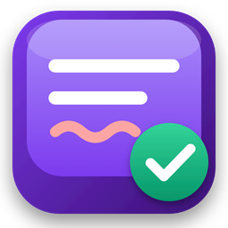

# ВАЛЄРА · VALERA

**Вільний локальний перемикач розкладок · UA · RU · EN**
_Free, private, spyware-free keyboard-layout switcher for Windows_

---

## Українською

**ВАЛЄРА** — безкоштовний застосунок, який автоматично виправляє текст, набраний не в тій розкладці, і перемикає **UA / RU / English** за аналізом слова. Проєкт **для всіх** — без винятків, без умов.

Це історія про **якісне, чесне програмне забезпечення**:

- **Безкоштовно й назавжди.** Жодних передплат, реклами чи прихованих умов.
- **Приватність передусім.** Без мережі, без телеметрії, без збору даних — усе працює **локально** на вашому комп'ютері. Мережа задіюється лише тоді, коли ви самі натискаєте «Перевірити оновлення».
- **Зроблено ретельно.** Підписані збірки, автоматичні тести, вимірна точність перемикання, світла й темна теми у стилі Windows.

### Можливості
- Автоперемикання **UA / RU / English** за аналізом слова
- Ручна конвертація (**Break** / подвійний **Shift**), зміна регістру, транслітерація
- Власні словники та автозаміни, нормалізація термінології
- Не чіпає поля паролів; діагностика — **лише за вашою згодою**
- Світла / темна / системна тема, як у сучасному Windows

### Встановлення
Завантажте найновішу **підписану** збірку на сторінці **[Releases](../../releases/latest)** і запустіть. Оновлення — прямо із застосунку: трей → «Перевірити оновлення…».

---

## In English

**VALERA** automatically fixes text typed in the wrong keyboard layout and switches **UA / RU / English** based on word analysis. Made **for everyone** — no exceptions, no strings attached.

A project about **honest, quality software**:

- **Free, forever.** No subscriptions, ads, or hidden terms.
- **Privacy first.** No network, no telemetry, no data collection — everything runs **locally** on your machine. The network is used only when you press “Check for updates” yourself.
- **Built with care.** Signed builds, automated tests, measured switching accuracy, native light & dark themes.

Download the latest **signed** build from **[Releases](../../releases/latest)**.

---

## Підтримати проєкт · Support

Проєкт **вільний і таким залишиться**. Якщо ВАЛЄРА стала вам у пригоді й ви хочете підтримати розробку якісного ПЗ — скористайтеся **кнопками підтримки** прямо в застосунку (**Про програму → Монобанк / Ko-fi**) або тут:

&nbsp;

Кожна підтримка йде на розвиток і нове обладнання. Це не обов'язково — але дуже допомагає. Дякую 🙏

_The project is free and always will be. If it's useful to you, supporting the development of quality software is warmly appreciated — but never required._

---

**Автор · Author:** Павло Ісаєв · [caussa.blog](https://caussa.blog)

